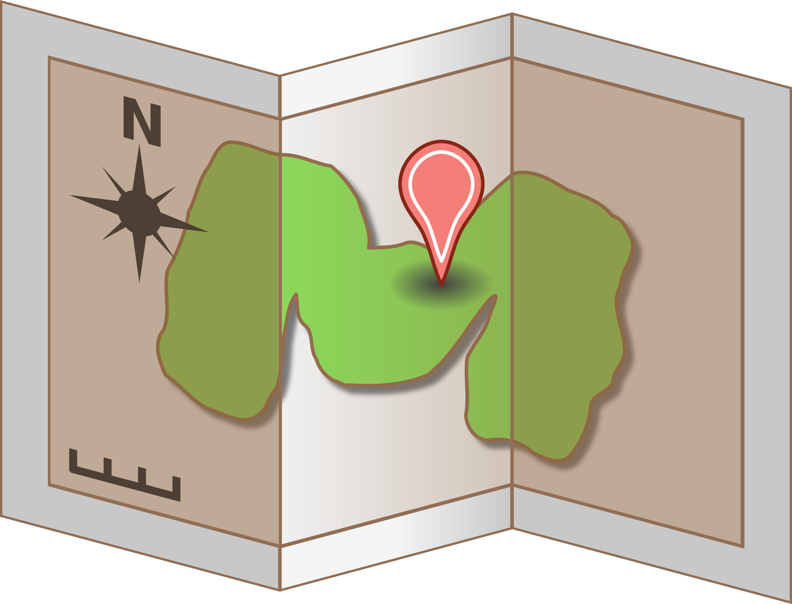
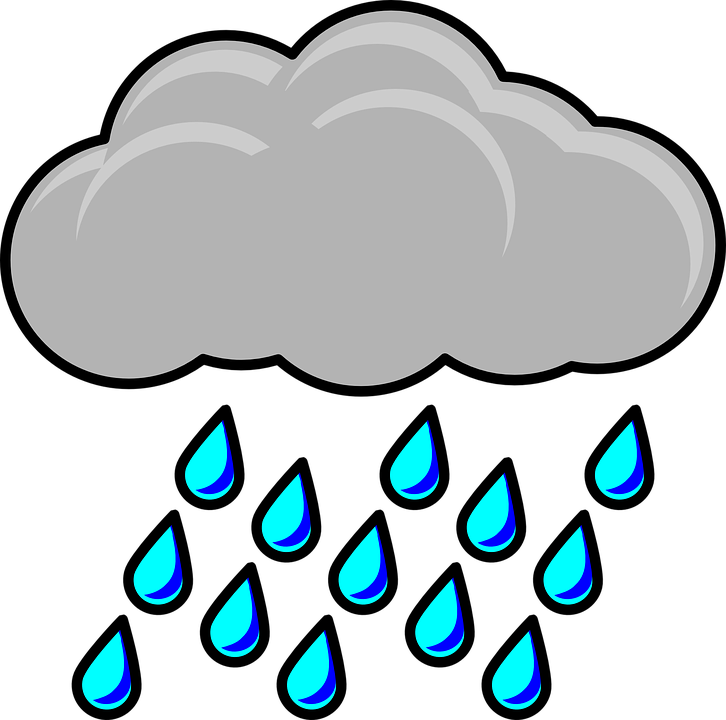
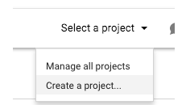
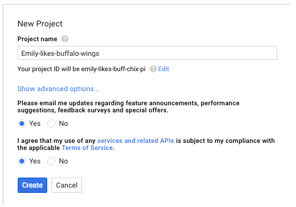
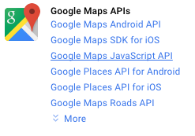
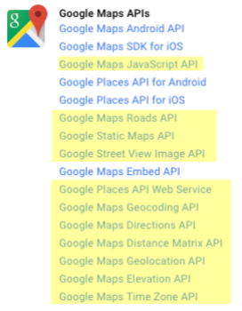
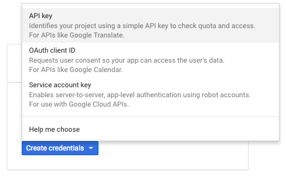
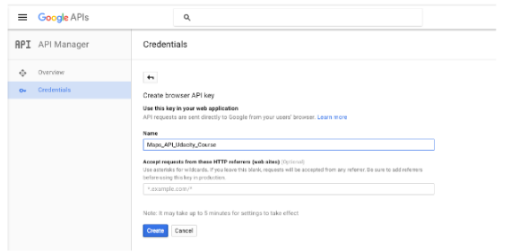

# 📌 Fort Worth Map
 

The main task of this project is to develop a single page application featuring a map of my neighborhood. The map include many functionality such as creating markers and highlighted locations, data about those locations and various ways to browse the content.

## Installation & Run
1. Clone the [Fort-Worth-Map](https://github.com/Nshmais/Fort-Worth-Map) github repository.
2. Generated/ Replace `API key`. For more info check next section `Google API key`.
3. Double click on `Neighberhood_map.html` file that you cloned.
4. Welcome to Fort Worth, TX
## Yahoo Weather API
 The weather APIsearch is avalible in the navbar and only needs city and state as inputs (ex. `Fort Worth, TX`) to work and display current temperature in fahrenheit (°F) and sky condition.

## Markers Search
 The navbar also contain a markers search responding to the input of the search keyword. When clicking on the marker display in search result the corresponding marker location on the map will bounce.  

## Google API key
In order to use Google_Maps API we will meed a key. **Make sure you replace "MYAPIKEY" in the JavaScript API call with your generated API key in code.** please, follow the instruction bellow to get the key: 
1. Visit [console.developers.google](https://console.developers.google.com)
2. Sign in with your Google - i.e. yourname@gmail.com. If you don't have one, you can go to [accounts.google.com](https://myaccount.google.com/) to create one for free.
3. Click on "Select a Project" and then "Create a Project" in the upper right side of


4. Name your project something descriptive, such as "Maps-Project" or "Emily-likes-buffalo-wings". Select whether you'd like to receive updates (usually a good idea) and select whether you agree to the terms of service. 


5. Click the "Create" button.
6. Click on the "Google Maps JavaScript API" under "Google Maps APIs" 


7. Click the "Enable" button
8. Repeat steps 6 and 7 for the following APIs (highlighted in yellow): 


9. Click the “Credentials” menu item on the left of the screen
10. Click the “Create Credentials” button
11. Select “API Key” from the options that appear.


12. Select the “Browser Key” button
13. Name your API Key something descriptive, such as Maps_API. It should reflect your intended use of the key. Click the “Create” button 


14. Repeat steps 10 and 11 for “Server Key,” if you will be making server-side requests. You can access these keys at any time by visiting the “Credentials” sub-menu under the “API Manager” menu

## Geocoding
[Geocoding](https://developers.google.com/maps/documentation/geocoding/intro) is the process of converting addresses (like "1600 Amphitheatre Parkway, Mountain View, CA") into geographic coordinates (like latitude 37.423021 and longitude -122.083739), which you can use to place markers on a map, or position the map and the other way around.
To get Geocoding service (**Address to location**), you need to google the following URL with the required parameters.
```
http://maps.googleapis.com/maps/api/geocode/outputFormat?parameters
```
This is an example of Six Flags location in Arlington, Texas. You can click the link [here](http://maps.googleapis.com/maps/api/geocode/json?address=2201+Road+to+Six+Flags+Arlington+TX) 
```
http://maps.googleapis.com/maps/api/geocode/json?address=2201+Road+to+Six+Flags+Arlington+TX
```
then we look for location in the result: 
```
 "location" : {
               "lat" : 32.75570450000001,
               "lng" : -97.07259839999999
            }
```

## Requirements
- To get the map into full screen mode click on Google-Icon on the map  

## License
`Fort-Worth-Map` is a released under the [MIT License](https://opensource.org/licenses/MIT)


